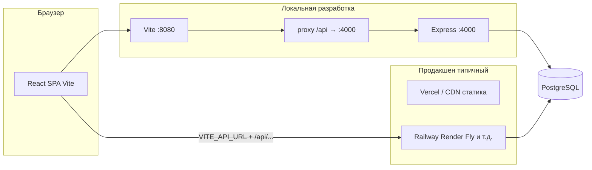
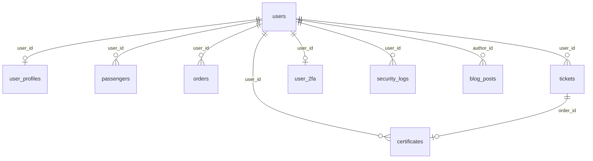

# Trip Spark — справочник проекта для разработки и ИИ

Веб-платформа для поиска и оформления билетов (поезд, самолёт, автобус), личный кабинет, оплата, 2FA, SMS/e-mail. Этот документ можно использовать как **контекст для ИИ**: стек, структура репозитория, схема БД, REST API, окружение и типичные сценарии.

---

## 1. Назначение продукта

- Поиск и выбор рейсов/маршрутов, оформление заказа, чекаут.
- Учётные записи: пароль, вход по e-mail OTP и SMS, JWT-сессии.
- Профиль пользователя, сохранённые пассажиры, билеты, сертификаты.
- Оплата через интеграцию **WebPay** (подписи, callback).
- Поддержка **2FA** (TOTP, резервные коды, e-mail при логине).
- Виджет поддержки: **Hugging Face Router** (`/api/support/chat`).
- Контент: справочные и гайдовые статьи (React Router).

---

## 2. Архитектура (высокий уровень)



- **Фронтенд:** одностраничное приложение (SPA), собирается в `dist/`.
- **Бэкенд:** один процесс **Express** (`server/index.js`), маршруты API в `server/registerApiRoutes.js`, пул БД в `server/db.js`.
- **БД:** один экземпляр **PostgreSQL**; схема задаётся файлом `postgres/schema.sql` (не Supabase Runtime).
- **Важно (ES modules):** переменные из `.env` для подключения к БД загружаются в **`server/db.js`** до создания `pg.Pool`, иначе `DATABASE_URL` может быть пустым при старте.

---

## 3. Технологии

### 3.1. Frontend

| Область | Технология |
|--------|------------|
| UI | React 18, TypeScript |
| Сборка | Vite 5 |
| Маршрутизация | React Router 6 |
| Состояние / запросы | TanStack React Query |
| Стили | Tailwind CSS 3 |
| Компоненты | Radix UI, shadcn-паттерн (`src/components/ui/`) |
| Формы | react-hook-form, zod, @hookform/resolvers |
| Тема | next-themes |
| HTTP к API | `fetch` обёртка `src/lib/api.ts`, cookie `access_token` |
| PDF / QR | pdf-lib, @pdf-lib/fontkit, qrcode |
| Прочее | date-fns, recharts, embla-carousel, vaul, cmdk, sonner |

### 3.2. Backend

| Область | Технология |
|--------|------------|
| Runtime | Node.js (ES modules, `"type": "module"`) |
| HTTP | Express 4 |
| БД | `pg` (пул соединений) |
| Авторизация | JWT (`jsonwebtoken`), bcrypt (`bcryptjs`) |
| 2FA | `otplib` (TOTP) |
| Rate limit | `express-rate-limit` |
| Почта OTP | `nodemailer` |
| SMS | МТС Exolve HTTP API (`server/sendSms.js`) |
| Оплата | SHA1-подписи WebPay (`server/webpayNode.js`), `md5` |
| Конфиг | `dotenv` |
| HTTP из Node | `node-fetch` |
| ИИ-чат | запросы к Hugging Face Router (`server/index.js`) |

### 3.3. Инфраструктура и деплой

- **Локально:** `npm run dev` (Vite) + `npm run server` (Express).
- **Статика:** например Vercel (`vercel.json`: сборка Vite, SPA fallback на `index.html`).
- **API:** отдельный хост с `node server/index.js`, переменные окружения как в продакшене.
- **Postgres:** любой управляемый сервис (Neon, Supabase как только БД, Railway и т.д.).

---

## 4. Структура репозитория (ключевые пути)

```
trip-spark-90/
├── src/                    # React SPA
│   ├── App.tsx             # маршруты верхнего уровня
│   ├── main.tsx
│   ├── lib/api.ts          # apiFetch, VITE_API_URL, Bearer из cookie
│   ├── contexts/           # AuthContext и др.
│   ├── pages/              # экраны, гайды, справка, чекаут
│   └── components/         # UI, секции, виджеты
├── server/
│   ├── index.js            # Express, rate limits, /api/ping, /api/support/chat
│   ├── registerApiRoutes.js # основной REST: auth, профили, билеты, webpay, 2fa…
│   ├── db.js               # dotenv + Pool PostgreSQL
│   ├── webpayNode.js
│   ├── sendSms.js
│   └── emailOtp.js
├── postgres/
│   └── schema.sql          # актуальная схема БД (применять к чистой БД)
├── scripts/
│   └── create-user.js      # CLI: создание пользователя email+пароль + user_profiles
├── supabase/migrations/    # исторические SQL, справочно (раньше Supabase)
├── vite.config.ts          # dev proxy /api → 127.0.0.1:4000
├── vercel.json             # деплой фронта
└── package.json
```

---

## 5. Схема базы данных

Расширение: `pgcrypto` (UUID и крипто-утилиты для функций).

### 5.1. ER-диаграмма (сущности и связи)



### 5.2. Таблицы (кратко)

| Таблица | Назначение |
|---------|------------|
| **users** | Учётная запись: `email` (unique), `password_hash`, `phone`, `is_admin` (флаг доступа к `/admin` и `/api/admin/*`), `raw_user_meta` (JSONB), таймстампы. Замена `auth.users` в монолитной схеме. |
| **user_profiles** | Профиль: ФИО, телефон, e-mail для отображения, `birth_date`. `user_id` UNIQUE → один профиль на пользователя. |
| **passengers** | Сохранённые пассажиры: паспортные данные, ФИО, пол, дата рождения. |
| **orders** | Заказы: `order_number` (unique), `status`, `total_amount`. |
| **tickets** | Билеты: тип транспорта (`train`/`flight`/`bus`), города, дата, JSON `tickets_data`, статусы оплаты и заказа, WebPay-поля. |
| **verification_codes** | SMS-коды: телефон, код, срок, used. |
| **email_otp_challenges** | E-mail OTP: email, code, purpose, expires_at, used. |
| **certificates** | Подарочные/сертификаты: код, сумма, срок, связь с билетом. |
| **security_logs** | Логи: уровень, сообщение, user_id, IP, user_agent, metadata JSONB. |
| **user_2fa** | Секрет TOTP, `enabled`, массив backup-кодов. |
| **blog_posts** | Статьи блога (CMS): `slug` (unique), метаданные, `content_blocks` (JSONB — массив блоков: paragraph, heading, image, quote, divider), `status` (`draft`/`published`), `published_at`, теги/бейджи/канал, счётчик `views`, `author_id` → `users`. |

### 5.3. Ограничения и ENUM-подобные поля (важно для ИИ-запросов)

- **tickets.transport_type:** `train` \| `flight` \| `bus`
- **tickets.electronic_registration_status:** `pending` \| `confirmed`
- **tickets.order_status:** `active` \| `refunded` \| `exchanged`
- **tickets.payment_status:** `pending` \| `paid` \| `failed` \| `cancelled`
- **certificates.status:** `active` \| `used` \| `expired`
- **security_logs.level:** `info` \| `warn` \| `error` \| `security`
- **blog_posts.status:** `draft` \| `published`
- **blog_posts.channel:** `tudasuda` \| `partners` \| `special`

### 5.4. Триггеры

Функция `update_updated_at_column()` обновляет `updated_at` при UPDATE для: `users`, `user_profiles`, `passengers`, `orders`, `tickets`, `certificates`, `user_2fa`, `blog_posts`.

### 5.5. SQL-функции (логика в БД)

| Функция | Назначение |
|---------|------------|
| `cleanup_expired_codes()` | Удаление просроченных/использованных SMS-кодов |
| `generate_certificate_code()` | Генерация уникального 10-значного кода сертификата |
| `expire_old_certificates()` | Пометка просроченных сертификатов |
| `create_certificate(...)` | Создание сертификата пользователю |
| `generate_2fa_secret(user_id)` | Секрет + backup-коды (upsert в `user_2fa`) |
| `enable_2fa` / `disable_2fa` | Вкл/выкл 2FA |
| `is_2fa_enabled(user_id)` | Проверка (используется при логине) |
| `use_backup_code(user_id, code)` | Списание одного резервного кода |

Полные определения — в `postgres/schema.sql`.

### 5.6. Применение схемы

```bash
psql "$DATABASE_URL" -f postgres/schema.sql
```

Уже есть база без новых таблиц — по одному файлу из `postgres/migrations/` (например `002_blog_posts.sql`).

---

## 6. REST API (Express)

Префикс путей: **`/api`**. Аутентификация: заголовок **`Authorization: Bearer <JWT>`** или cookie **`access_token`** (сервер умеет читать оба).

### 6.1. Сводка маршрутов

| Метод | Путь | Защита | Назначение |
|-------|------|--------|------------|
| GET | `/api/auth/session` | JWT | Текущая сессия |
| POST | `/api/auth/login` | — | Логин паролем (email или телефон) |
| POST | `/api/auth/2fa-login/send-email` | pre_2fa | Отправка кода 2FA на почту |
| POST | `/api/auth/2fa-login/verify` | pre_2fa | Проверка кода → выдача access JWT |
| POST | `/api/auth/email/send-otp` | — | Отправка e-mail OTP |
| POST | `/api/auth/email/verify-otp` | — | Вход/регистрация по e-mail OTP |
| POST | `/api/auth/sms/send` | — | Отправка SMS |
| POST | `/api/auth/sms/verify` | — | Вход/регистрация по SMS |
| PATCH | `/api/auth/me` | JWT | Обновление email/phone/password |
| GET/PUT | `/api/user-profiles/me` | JWT | Чтение/запись профиля |
| GET/POST | `/api/passengers` | JWT | Список / создание пассажиров |
| PATCH/DELETE | `/api/passengers/:id` | JWT | Изменение / удаление |
| GET | `/api/tickets` | JWT | Список билетов |
| GET | `/api/tickets/by-order/:orderNumber` | JWT | По номеру заказа |
| GET | `/api/tickets/:id` | JWT | Один билет |
| POST/PATCH | `/api/tickets`, `/api/tickets/:id` | JWT | Создание / обновление |
| POST | `/api/rpc/expire_old_certificates` | JWT | RPC истечения сертификатов |
| POST | `/api/rpc/create_certificate` | JWT | RPC создания сертификата |
| POST | `/api/rpc/is_2fa_enabled` | JWT | RPC проверки 2FA |
| GET/PATCH | `/api/certificates`, `/api/certificates/:id` | JWT | Сертификаты |
| GET | `/api/certificates/by-code/:code` | JWT | По коду |
| POST | `/api/2fa/*` | JWT | generate-secret, verify-totp, enable, disable, backup, e-mail шаги |
| POST | `/api/logs` | — | Приём клиентских логов (лимит тела) |
| POST | `/api/webpay-create` | JWT | Инициация оплаты |
| POST | `/api/webpay-notify` | — | Callback WebPay (подпись) |
| GET | `/api/auth/public/profile-by-phone` | — | Публичный поиск профиля по телефону |
| POST | `/api/auth/match-profiles-last10` | — | Сопоставление профилей по последним 10 цифрам |
| GET | `/api/auth/sms/count-recent` | — | Счётчик недавних SMS |
| GET | `/api/ping` | — | Healthcheck |
| POST | `/api/support/chat` | rate limit | ИИ-помощник (HF Router) |
| GET | `/api/blog/posts` | — | Список опубликованных статей (как карточки на `/blog`) |
| GET | `/api/blog/posts/by-slug/:slug` | — | Статья + `content_blocks`; инкремент `views` |
| GET | `/api/admin/blog/posts` | admin | Список всех статей (без тела) |
| GET | `/api/admin/blog/posts/id/:id` | admin | Полная статья + `body_text` (склейка параграфов для редактора) |
| POST | `/api/admin/blog/posts` | admin | Создание (JSON или `body_text` → параграфы) |
| PATCH | `/api/admin/blog/posts/id/:id` | admin | Обновление |
| DELETE | `/api/admin/blog/posts/id/:id` | admin | Удаление |

Точное тело запросов и ответов — в `server/registerApiRoutes.js`, блог — `server/blogRoutes.js`.

### Админ API (только `users.is_admin = true`)

Проверка на каждый запрос: JWT + `SELECT is_admin FROM users`. В JWT есть поле `adm` (информационное), источник истины — БД.

| Метод | Путь | Назначение |
|-------|------|------------|
| GET | `/api/admin/stats/overview` | Сводка: число пользователей, билетов, заказов; выручка по оплаченным билетам; разбивки по статусам |
| GET | `/api/admin/stats/timeseries?days=7..90` | Ряды по дням: регистрации, созданные билеты, выручка по `payment_paid_at` |

Реализация: `server/adminApiRoutes.js`, middleware — `server/authMiddleware.js` (`adminMiddleware`).

**UI:** маршруты SPA `/admin` (layout `src/pages/admin/AdminLayout.tsx`), дашборд `/admin/dashboard`, заглушки под CMS блога и маршрутов.

**Назначить администратора (после миграции колонки):**

```bash
# Уже существующая БД без is_admin — один раз:
psql "$DATABASE_URL" -f postgres/migrations/001_add_user_is_admin.sql

npm run set-admin -- grant you@mail.com
# или при создании пользователя:
npm run create-user -- you@mail.com пароль --admin
```

После выдачи прав администратора пользователь должен **выйти и войти снова**, чтобы в JWT попал актуальный флаг.

---

## 7. Переменные окружения

### 7.1. Сервер (`.env` в корне; **именно его** читает `server/db.js` и процесс Express)

| Переменная | Обязательность | Назначение |
|------------|----------------|------------|
| `DATABASE_URL` | Да | PostgreSQL connection string (`@` в пароле — URL-encode как `%40`) |
| `JWT_SECRET` | Продакшен: да | Подпись JWT (в dev есть небезопасный fallback) |
| `JWT_EXPIRES_IN` | Нет | Срок access-токена, по умолчанию `30d` |
| `PORT` | Нет | Порт Express (платформа деплоя часто задаёт сама) |
| `EXOLVE_API_KEY`, `EXOLVE_SENDER` | Для SMS | МТС Exolve |
| `SMTP_HOST`, `SMTP_PORT`, `SMTP_USER`, `SMTP_PASS`, `SMTP_FROM` | Продакшен e-mail | OTP и 2FA по почте; без SMTP в dev код может логироваться в консоль |
| `WEBPAY_STORE_ID`, `WEBPAY_SECRET_KEY`, `WEBPAY_CURRENCY_ID`, `WEBPAY_TEST_MODE` | Для оплаты | WebPay |
| `WEBPAY_PUBLIC_API_BASE` | Для callback | Публичный базовый URL API для `wsb_notify_url` |
| `SKIP_WEBPAY` | Нет | Если `true` / `1`: оплата WebPay не вызывается; билет сразу получает `payment_status = paid`, редирект на `/payment/success` и генерация PDF. **Не включайте в продакшене**, если нужна реальная оплата. |
| `HF_API_TOKEN`, `HF_MODEL` | Для чата | Hugging Face Router |

### 7.2. Фронтенд (Vite)

| Переменная | Назначение |
|------------|------------|
| `VITE_API_URL` | Базовый URL API **без** завершающего `/`. Пусто = относительные пути `/api/...` (локально проксируется на :4000). В продакшене на Vercel задать URL бэкенда. |

---

## 8. Команды npm

```bash
npm install          # зависимости
npm run dev          # Vite, порт 8080, proxy /api → 4000
npm run server       # Express API, порт из PORT или 4000
npm run build        # production-сборка SPA → dist/
npm run preview      # превью сборки
npm run lint         # ESLint
npm run create-user  # node scripts/create-user.js <email> <password> [--reset] [--admin]
npm run set-admin    # grant|revoke <email> (на Windows надёжнее, чем --grant)
```

**Создание тестового пользователя с паролем:**  
`npm run create-user -- user@mail.com пароль_от_6_символов`  
Скрипт пишет в `users` и создаёт/обновляет строку в `user_profiles`. Флаг `--admin` выдаёт доступ к админ-панели.

---

## 9. Клиентский HTTP (`src/lib/api.ts`)

- База: `import.meta.env.VITE_API_URL` (может быть пустой строкой).
- К путям вида `/api/...` префикс добавляется только если задан `VITE_API_URL`.
- Cookie **`access_token`** автоматически подставляется в `Authorization`, если не переопределено в `init`.

---

## 10. Деплой (кратко)

1. Поднять **PostgreSQL**, выполнить `postgres/schema.sql`.
2. Задеплоить **Express** на PaaS, выставить все переменные из §7.1, старт: `node server/index.js`.
3. Задеплоить **Vite** на Vercel (или аналог): build `npm run build`, output `dist`, SPA rewrites (см. `vercel.json`).
4. В настройках фронта задать **`VITE_API_URL`** = публичный URL бэкенда.
5. Убедиться, что **CORS** и **WEBPAY_PUBLIC_API_BASE** / callback URL указывают на реальный API.

---

## 11. Дополнительная документация в репозитории

- **[EXOLVE_SETUP.md](./EXOLVE_SETUP.md)** — настройка SMS МТС Exolve.

---

## 12. Лицензия

Private project.
